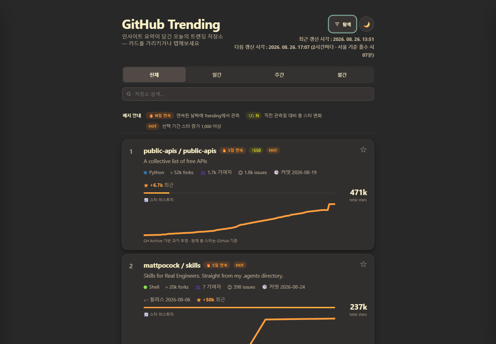
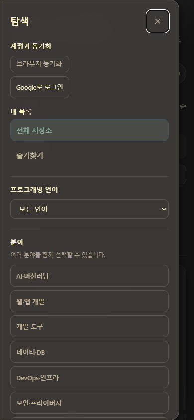

# GitHub Trending Daily

[English](README.en.md)

> 오늘 뜨는 저장소를 별 개수만 보고 지나치지 마세요. 왜 주목받는지, 어떻게 쓰는지, 내 관심 분야에 맞는지를 한 화면에서 빠르게 파악할 수 있습니다.

## 지금 만나보세요

<h2 align="center"><a href="https://nowwcastle-sudo.github.io/github-trending-daily/"><strong>🚀 GitHub Trending Daily 바로 열기</strong></a></h2>

서버 설치나 계정 생성 없이 바로 둘러볼 수 있습니다. 즐겨찾기 동기화가 필요할 때만 Google 로그인을 선택하세요.

## 실제 화면

두 이미지는 2026-08-26 실제 [운영 사이트](https://nowwcastle-sudo.github.io/github-trending-daily/)에서 촬영했습니다.

## 만든 배경

GitHub Trending은 새로운 프로젝트를 발견하기에는 좋지만, 저장소마다 README를 열어 목적과 사용법을 확인하고 일간·주간·월간 인기도를 비교하는 데 시간이 듭니다. GitHub Trending Daily는 이 탐색 비용을 줄이기 위해 Trending 데이터, GitHub 공개 메타데이터, README 기반 한국어 요약을 정돈된 카드에 모은 정적 대시보드입니다.

별 수만 높은 프로젝트가 아니라 지금 얼마나 빠르게 관심을 받고 있는지, 실제로 무엇을 하는 프로젝트인지, 내 관심 분야와 맞는지를 한 흐름에서 판단하도록 만들었습니다.

## 현재 기능

- **2시간 자동 갱신** — 일간·주간·월간 GitHub Trending 표본을 서울 시간 기준으로 정기 수집합니다.
- **정보 밀도 높은 저장소 카드** — 총 스타, 기간 증가량, 포크, 이슈, 기여자, 최근 커밋·릴리스를 함께 보여줍니다.
- **변화 신호** — 스타 히스토리, 연속 Trending 일수, 직전 관측 대비 변화, HOT 배지로 상승 흐름을 표시합니다.
- **기간 보기** — 전체·일간·주간·월간 결과를 한 번에 전환합니다.
- **선택 가능한 정렬** — 기본 Trending 원래 순서를 유지하거나 선택 기간 스타 증가, 총 스타, 최근 푸시, 최근 릴리스 순으로 정렬합니다. 값이 없는 저장소는 뒤에 표시되고 동률은 원래 순서를 유지합니다.
- **검색과 언어 필터** — 저장소 텍스트를 검색하고 프로그래밍 언어로 좁힙니다.
- **분야 다중 태그** — AI·머신러닝, 웹·앱 개발, 개발 도구, 데이터·DB, DevOps·인프라, 보안·프라이버시 등 여러 분야를 함께 선택합니다.
- **형태·기술 다중 태그** — Agent, MCP, Plugin·Skill, IDE·코딩 도구, Library·SDK, Framework, CLI·Automation을 분야와 독립적으로 조합합니다.
- **AI 제외 토글** — AI 관련 저장소를 한 번에 제외해 다른 분야의 프로젝트를 발견합니다.
- **공유 가능한 URL 상태** — 기간, 정렬, 즐겨찾기 보기, 검색어, 언어, 분야·형태 태그, AI 제외 조건을 주소에 보존하고 뒤로가기로 복원합니다. 브라우저에만 속하는 숨김 선택은 URL에 포함되지 않습니다.
- **반응형 요약과 README 뷰어** — 데스크톱은 조건부 툴팁, 모바일은 첫 탭 요약을 제공하며 원문·캐시된 한국어 README를 나란히 확인합니다.
- **브라우저별 관심 없음** — 데스크톱 툴팁이나 모바일 요약에서 저장소를 숨기고 즉시 되돌리거나 사이드바에서 개별·전체 복구합니다. 숨겨도 즐겨찾기 상태는 그대로 유지됩니다.
- **로컬·계정 즐겨찾기** — 로그아웃 상태는 현재 브라우저에 저장하고, Google 로그인 시 같은 계정의 기기·브라우저 사이에서 동기화합니다.
- **사이드바 중심 탐색** — 왼쪽 가장자리의 탐색 아이콘으로 오버레이 사이드바를 열고 맨 위에서 최근·다음 갱신 시각을 확인합니다. 다시 누르거나 바깥을 클릭하거나 Escape를 눌러 닫습니다.
- **접근 가능한 반응형 UI** — 라이트·다크 테마, 키보드 포커스, 모바일 44px 터치 대상, reduced-motion·reduced-transparency 환경을 지원합니다.

## 추가 예정 기능

- **분류 정밀도 고도화** — 누적 Trending 표본과 GitHub Topics를 표본 검수해 분야·형태 태그 규칙을 계속 조정합니다.
- **개인화 추천은 후순위로 설계** — 공식 OAuth·약관·토큰 범위·정적 사이트 키 노출·과금 오남용을 검증한 뒤, 개인정보를 최소화하는 별도 기능으로 검토합니다.

## 사용 방법

1. [운영 사이트](https://nowwcastle-sudo.github.io/github-trending-daily/)를 엽니다.
2. 상단에서 전체·일간·주간·월간 기간을 고르거나 저장소 이름·설명을 검색합니다.
3. 왼쪽 가장자리의 **탐색 아이콘**을 눌러 정렬, 즐겨찾기 보기, 프로그래밍 언어, 분야, 형태·기술, AI 제외 조건을 조합합니다. 같은 그룹 안은 OR, 서로 다른 그룹 사이는 AND로 적용됩니다.
4. 데스크톱에서는 카드에 마우스를 올리고, 모바일에서는 카드를 한 번 탭해 프로젝트 목표·사용법·장단점을 확인합니다. **관심 없음**을 누르거나 키보드로 카드에 초점을 둔 뒤 Delete를 누르면 현재 브라우저에서 숨겨지며, 알림의 되돌리기나 사이드바에서 복구할 수 있습니다.
5. 별 버튼으로 즐겨찾기를 저장합니다. 로그인하지 않으면 현재 브라우저에, Google로 로그인하면 같은 계정에 동기화됩니다.
6. 정렬이나 필터를 적용한 주소를 복사하면 같은 탐색 조건을 공유할 수 있습니다. 숨김 선택은 공유되지 않습니다.

## 갱신과 데이터

GitHub Actions가 서울(Asia/Seoul) 기준 홀수 시각의 07분에 실행되어 약 2시간마다 데이터를 갱신합니다. GitHub Trending 페이지와 GitHub REST API의 공개 저장소 메타데이터·Topics를 사용하며, 현재 총 스타는 GitHub 기준이고 과거 스타 히스토리는 GH Archive 기반 추정치가 섞일 수 있습니다.

README 한국어 번역은 새 저장소이거나 **README 해시**가 바뀐 경우에만 유료 번역 대기열에 들어가도록 비용 게이트를 둡니다. 사이트는 GitHub Pages에서 정적으로 제공되며, 개인화 추천이나 사용자 API 키를 현재 페이지에 노출하지 않습니다.
