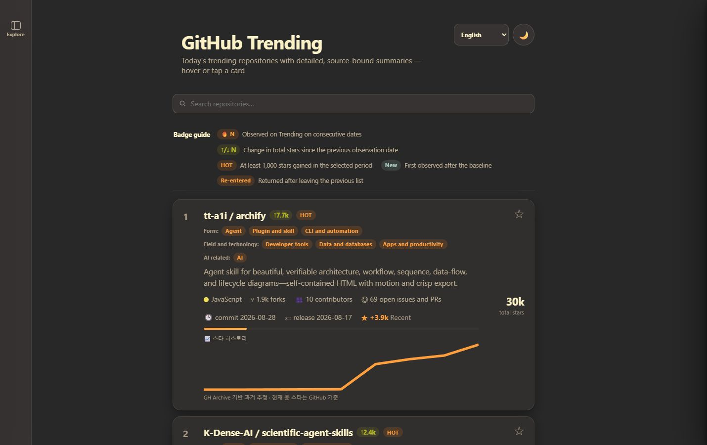
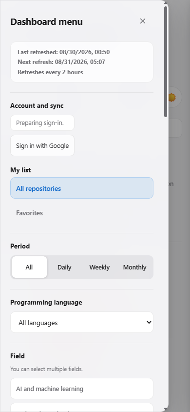

# GitHub Trending Daily

[한국어](README.ko.md)

> A focused, static dashboard for understanding what a trending repository does, how it is used, and whether it is relevant—not just how many stars it has.

<h2 align="center"><a href="https://nowwcastle-sudo.github.io/github-trending-daily/"><strong>Open GitHub Trending Daily</strong></a></h2>

No server setup or account is required. Google sign-in is optional and is used only to synchronize favorites.

## Current implementation status

The multilingual interface, Compact Rail navigation, source-bound README viewer, and five-language summary pipeline are implemented in the current source. The repository includes a locally reproduced 45-repository v1 snapshot; the public site's exact deployed revision must still be confirmed from its deployment manifest. Generic legacy summaries, missing README provenance, or incomplete language bundles are never counted as a successful v1 release.

The interface screenshots below were captured from the 2026-08-31 source at 1440 px and 390 px. The deployment manifest, rather than a screenshot, is the production revision proof.



<p align="center"></p>

## What changed in this version

- **English-first repository documentation** — This `README.md` is the canonical English document. The complete Korean version is in [README.ko.md](README.ko.md); [README.en.md](README.en.md) remains as a compatibility pointer.
- **Five site languages** — Stable interface text can be switched among English, Korean, Simplified Chinese, Spanish, and Japanese. Repository cards keep their source data and are not mechanically translated on every refresh.
- **Five-language summary bundles** — Every enriched repository provides English, Korean, Simplified Chinese, Spanish, and Japanese summaries with the same five field roles and README-backed facts. Natural wording, sentence count, emphasis, and total length may differ by language.
- **The same summary on desktop and mobile** — Responsive layout changes presentation only. It never shortens or weakens the summary on a smaller screen.
- **Compact Rail navigation** — On desktop, the 64 px Explore rail opens a passive sidebar on hover and a focus-trapped modal when clicked or activated from the keyboard. Mobile uses right-edge swipe to open and left swipe to close; the native Explore button stays visually hidden unless reached by a screen reader or hardware keyboard.
- **README variants from upstream only** — The viewer lists only README language files that actually exist in the repository. It verifies path, immutable blob SHA, default-branch head SHA, and content SHA-256 before rendering. This project no longer generates or stores full README translations.
- **Site-bound summary language** — The header language alone selects the tooltip summary. There is no second language selector inside the tooltip; if that exact locale is incomplete, the interface reports it as unavailable instead of falling back silently.
- **Exact period membership** — Daily, weekly, and monthly show only repositories with a valid rank and gain for that period. Combined is their union and shows total stars without period gain, HOT, or the gain bar.

## Summary quality contract

The refresh pipeline is configured for `claude-sonnet-5` through Claude CLI OAuth and has no dollar-cost calculation stage. No model call happens before repository and README collection succeeds.

Each repository is produced as one atomic five-language bundle:

- `goal`, `usage`, `pros`, `cons`, and `fit` must be distinct, keep their semantic roles, and be grounded in the verified README. Installation and execution instructions belong in `usage`.
- The English bundle may contain 100–280 words. Other locales are not required to match its word count, sentence count, phrasing, or information order.
- Only commands that appear in the README may be quoted, limited to one or two central commands and retained in the same semantic field across locales.
- Generic “see the README” fallbacks are invalid. Subjective wording alone does not fail an otherwise source-backed, structurally complete summary.
- README path, blob, content hash, and default-branch head identify the shared canonical source; they are not used to require byte-for-byte or perfectly equivalent prose across locales. Evidence is retained as README headings and line ranges, while full README bodies are not written to the observation database.
- Up to three repository-level quality corrections are allowed within the existing bounded attempt and token policy.
- One missing locale, misplaced or unbacked immutable token, insufficient source, or schema defect fails the entire repository and therefore the candidate.

The interface describes these summaries accurately as AI-generated from a verified repository README; it does not claim human verification.

## Features

- Daily, weekly, monthly, and combined GitHub Trending views with exact period membership.
- Total stars everywhere; exact period gain and HOT only in daily, weekly, and monthly views, plus forks, issues and pull requests, contributors, recent commits, and releases.
- Momentum history, consecutive Trending observations, rank change, new, and re-entered signals.
- Search plus programming-language, field, form, technology, favorites, and AI-exclusion filters.
- Stable sorting by selected-period Trending rank, period gain, total stars, latest push, or latest release; Combined preserves source order.
- Shareable URL state for public discovery controls; browser-local hidden repositories are not included.
- Per-browser **Not interested** with undo and individual or complete recovery.
- Local favorites when signed out and optional Google-account synchronization when signed in.
- Current-view CSV and JSON export containing public fields only, plus a copyable discovery URL.
- [feed.xml](https://nowwcastle-sudo.github.io/github-trending-daily/feed.xml) for the current repository set and [changes.xml](https://nowwcastle-sudo.github.io/github-trending-daily/changes.xml) for new and re-entered membership events.
- Light and dark themes, keyboard navigation, focus trapping, 44 px touch targets, reduced-motion handling, reduced-transparency handling, BFCache restoration, and responsive layouts.

## How to use

1. Open the [site](https://nowwcastle-sudo.github.io/github-trending-daily/).
2. Choose the site language in the header.
3. Open **Explore** to combine period, sorting, favorites, programming language, field, form, technology, and AI-exclusion filters. Choices use OR within a group and AND between groups.
4. Hover or focus a card on desktop, or tap it on mobile, to open the complete summary in the header's selected site language.
5. Select **View README** to see the verified canonical README and any upstream language variants that the repository actually provides.
6. Save a favorite locally or sign in with Google to synchronize it. Hiding a repository does not remove its favorite.
7. Export the current public view as CSV or JSON, copy its URL, or subscribe to an Atom feed.

## Refresh and publication safety

When activated, GitHub Actions is scheduled at minute 07 of odd-numbered hours in `Asia/Seoul`, approximately every two hours. The workflow collects and freezes canonical repository and README facts before considering enrichment. It must then complete exact five-language coverage, provenance validation, rendering, observation recording, and artifact validation before publication.

Scheduled Daily Refresh keeps Claude CLI OAuth with `claude-sonnet-5` as the default summary producer. Codex is a fallback only for the exact repositories that remain pending against the same frozen input; it does not replace the scheduled default or regenerate already complete repositories.

- **Code release** — Record, derive, and finalize a new v1 snapshot from the current Pages code bytes, then deploy it.
- **Finalized artifact redeploy** — Redeploy only an artifact that is byte-for-byte identical to the source already finalized. If Pages bytes changed under the old finalized contract, the builder stops before artifact or manifest output and requires a full refresh.

The workflow is fail closed:

- The model is called zero times if collection fails.
- An incomplete enrichment candidate writes no observation, page, commit, or Pages deployment.
- A failed candidate leaves the tracked tree unchanged.
- Missing or stale README provenance, source mismatch, incomplete chunks, invalid model output, cost-cap breaches, or translation residue stop publication.
- The browser never receives a provider API key.

Historical star charts can include GH Archive-derived estimates; current total stars come from GitHub. CSV uses a UTF-8 BOM for spreadsheet compatibility, quotes commas, quotes, and line breaks, and prefixes formula-like values with an apostrophe.

## Local verification

```powershell
npm test
python -m unittest discover -s tests -p "test_*.py"
```

Run these commands from the repository root in PowerShell. Production activation, workflow dispatch, and Pages deployment are separate controlled steps.
