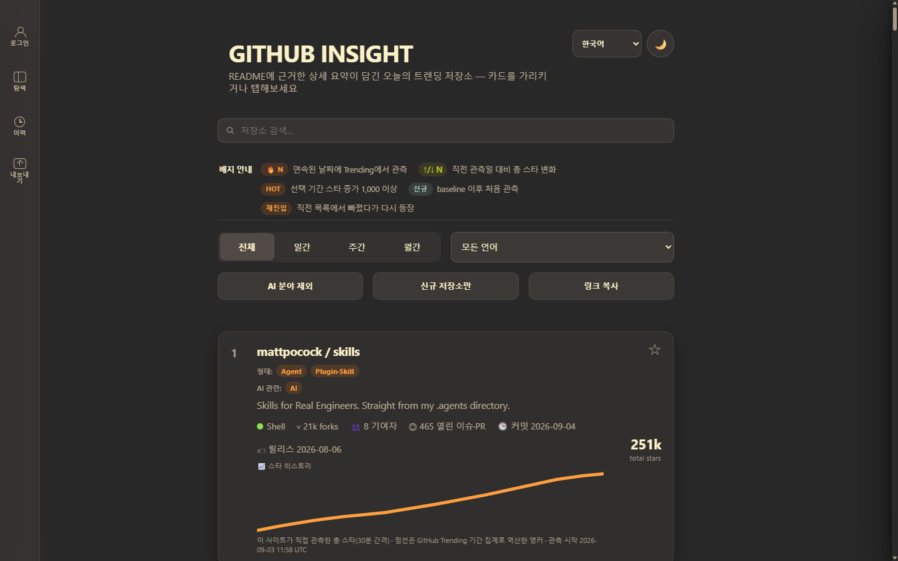
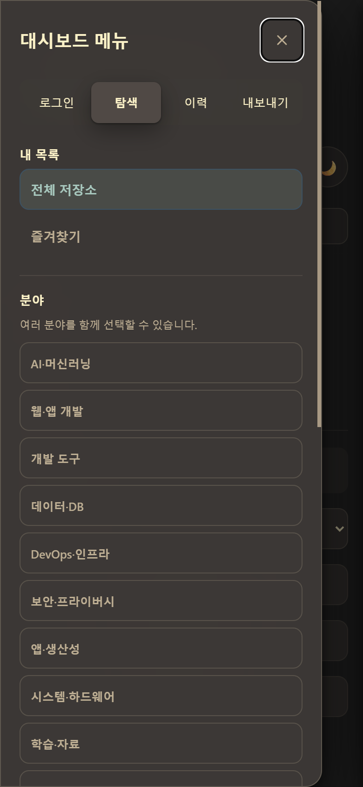

# GITHUB INSIGHT

[한국어](README.ko.md)

> A focused, static dashboard for understanding what a trending repository does, how it is used, and whether it is relevant—not just how many stars it has.

<h2 align="center"><a href="https://nowwcastle-sudo.github.io/github-trending-daily/"><strong>Open GITHUB INSIGHT</strong></a></h2>

No server setup or account is required. Google sign-in is optional and is used only to synchronize favorites.

## What it does

GITHUB INSIGHT watches the repositories that appear on GitHub Trending (daily, weekly, and monthly) and, for each one, gives you two things other trending pages do not: a star count this site measured itself rather than a third-party estimate, and a verified summary generated from the repository's own README rather than a generic description. You can filter, sort, favorite, and export the current view, and subscribe to Atom feeds instead of checking back manually.

## Current implementation status

The multilingual interface, four-group Compact Rail navigation, source-bound README viewer, and five-language summary pipeline are implemented in the current source. The repository includes a locally reproduced 45-repository v1 snapshot; the public site's exact deployed revision must still be confirmed from its deployment manifest. Generic legacy summaries, missing README provenance, or incomplete language bundles are never counted as a successful v1 release.

The interface screenshots below were captured on 2026-09-05 from production at 1440 px and 390 px, with all four rail groups (Login, Explore, History, Export) visible. The deployment manifest, rather than a screenshot, is the production revision proof.



<p align="center"></p>

## Four rail groups

The 64 px rail on the left has four buttons, each opening the same panel with a different group selected. On desktop it opens a passive sidebar on hover (with a short close grace period so the pointer can cross the gap) and a focus-trapped modal when clicked or activated from the keyboard; on mobile, right-edge swipe opens it and left swipe closes it. The native trigger button stays visually hidden on mobile unless reached by a screen reader or hardware keyboard.

- **Login** — Google sign-in and favorites synchronization; local favorites still work when signed out.
- **Explore** — period, sorting, favorites, programming language, field, form, technology, and AI-exclusion filters. Choices use OR within a group and AND between groups.
- **History** — hidden ("Not interested") repositories with individual or complete recovery, and recently new or re-entered repositories.
- **Export** — CSV/JSON export of the current public view and a copyable discovery URL.

Keyboard shortcuts open the matching group directly: `a` for Login, `e` for Explore, `h` for History, `x` for Export. `/` moves focus to search, and `Escape` closes whichever panel is open.

## Filter bar

A compact filter bar sits directly under the badge guide, always visible without opening the rail panel: period (daily/weekly/monthly/combined), language, an **Exclude AI** toggle, a **New repositories only** toggle, and **Copy link**, which writes the current filter state to the clipboard as a shareable URL. It mirrors a subset of the Explore group's controls so the most common filters do not require opening the sidebar at all.

## Repository admission and held summaries

Each repository is admitted to the page on its own: it either ships with a complete, verified five-language summary, or it is published as **held**. A held repository's card still shows its measured data (stars, forks, activity, rank), but in place of the AI summary it shows a fixed, localized "summary being verified" notice and is retried automatically at the next scheduled refresh (every 6 hours). No other repository on the page is affected by one repository being held — GITHUB INSIGHT never falls back to an all-or-nothing publish.

## Star history

Star counts on this site are not estimated. The `star-ticks` workflow records the exact total star count of every published repository every 30 minutes, straight from the GitHub API, into this project's own append-only database (`data/star-ticks/YYYY-MM.jsonl`, `data/star-daily.jsonl`) — not a third-party service's derived numbers.

On the card, the solid line is that measured history; a dashed line with hollow markers extends it backward using anchors back-calculated from GitHub Trending's own period-gain figures (daily, weekly, monthly, and the creation date for repositories under 30 days old) wherever there is no direct observation yet. Because the chart only needs two points to draw a line, a repository can show its first line after about an hour (two 30-minute observations); a curve that meaningfully covers a full day of movement builds up over roughly the first day of observation.

## Summary quality contract

The refresh pipeline is configured for `claude-sonnet-5` through Claude CLI OAuth and has no dollar-cost calculation stage. No model call happens before repository and README collection succeeds.

Each repository is produced as one atomic five-language bundle:

- `goal`, `usage`, `pros`, `cons`, and `fit` must be distinct, keep their semantic roles, and be grounded in the verified README. Installation and execution instructions belong in `usage`.
- The English bundle may contain 100–280 words. Other locales are not required to match its word count, sentence count, phrasing, or information order.
- Only commands that appear in the README may be quoted, limited to one or two central commands and retained in the same semantic field across locales.
- Generic “see the README” fallbacks are invalid. Subjective wording alone does not fail an otherwise source-backed, structurally complete summary.
- README path, blob, content hash, and default-branch head identify the shared canonical source; they are not used to require byte-for-byte or perfectly equivalent prose across locales. Evidence is retained as README headings and line ranges, while full README bodies are not written to the observation database.
- Up to three repository-level quality corrections are allowed within the existing bounded attempt and token policy.
- One missing locale, misplaced or unbacked immutable token, insufficient source, or schema defect fails the entire repository and therefore the refresh — that repository is published `held` instead.

The interface describes these summaries accurately as AI-generated from a verified repository README; it does not claim human verification.

## Features

- Daily, weekly, monthly, and combined GitHub Trending views with exact period membership.
- Total stars everywhere; exact period gain and HOT only in daily, weekly, and monthly views, plus forks, issues and pull requests, contributors, recent commits, and releases.
- Momentum history from this site's own star observations, consecutive Trending observations, rank change, new, and re-entered signals.
- Search plus programming-language, field, form, technology, favorites, and AI-exclusion filters.
- Stable sorting by selected-period Trending rank, period gain, total stars, latest push, or latest release; Combined preserves source order.
- Shareable URL state for public discovery controls; browser-local hidden repositories are not included.
- Per-browser **Not interested** with undo and individual or complete recovery.
- Local favorites when signed out and optional Google-account synchronization when signed in.
- Current-view CSV and JSON export containing public fields only, plus a copyable discovery URL.
- README variants from upstream only — the viewer lists only README language files that actually exist in the repository, verified by path, immutable blob SHA, default-branch head SHA, and content SHA-256 before rendering. This project no longer generates or stores full README translations.
- [feed.xml](https://nowwcastle-sudo.github.io/github-trending-daily/feed.xml) for the current repository set and [changes.xml](https://nowwcastle-sudo.github.io/github-trending-daily/changes.xml) for new and re-entered membership events. Both feeds are titled `GITHUB INSIGHT — Current repositories` and `GITHUB INSIGHT — New and re-entered repositories`.
- Light and dark themes, keyboard navigation, focus trapping, 44 px touch targets, reduced-motion handling, reduced-transparency handling, BFCache restoration, and responsive layouts.

## Advantages over other trending sites

- **Its own measurements, not estimates.** Star counts come from this site's own 30-minute observations and history, recorded straight from the GitHub API into its own database — not a third-party estimate service, and not GitHub Trending's own gain figures (those are used only as dashed, back-calculated anchors where no direct observation exists yet).
- **Honest about incomplete summaries.** A repository whose summary fails verification is shown as `held` with its measured data intact, rather than silently shipping a wrong or generic summary or hiding the repository entirely.
- **Per-repository README-grounded summaries.** Every summary is generated from that repository's own verified README, in five locales, with the source path, blob SHA, and content hash recorded as provenance.
- **Two Atom feeds, not one.** One feed for the current repository set, one specifically for new and re-entered repositories, so you can subscribe to just the "what's new" signal.
- **Five real interface locales**, not machine-translated on every page load: English, Korean, Simplified Chinese, Spanish, and Japanese, with the same message keys in every locale.
- **Keyboard-first navigation.** `/`, `e`, `a`, `h`, `x`, and `Escape` reach every rail group and search without touching the mouse.
- **Four purpose-built rail groups** (Login, Explore, History, Export) instead of one catch-all menu.
- **Export and copy-link built in.** CSV/JSON export and a shareable filtered URL, with no account required.
- **No server.** The whole site is static; nothing you do in the browser is sent to a backend GITHUB INSIGHT operates, other than optional Google sign-in for favorites sync.

## How to use

1. Open the [site](https://nowwcastle-sudo.github.io/github-trending-daily/).
2. Choose the site language in the header.
3. Use the always-visible filter bar for period, language, **Exclude AI**, and **New repositories only**, or open the **Explore** group (`e`) for the full filter set: period, sorting, favorites, programming language, field, form, technology, and AI-exclusion filters. Choices use OR within a group and AND between groups.
4. Hover or focus a card on desktop, or tap it on mobile, to open the complete summary in the header's selected site language. A `held` repository shows a "summary being verified" notice instead, and is retried automatically.
5. Select **View README** to see the verified canonical README and any upstream language variants that the repository actually provides.
6. Open **Login** (`a`) to save a favorite locally or sign in with Google to synchronize it. Hiding a repository does not remove its favorite.
7. Open **History** (`h`) to review or restore hidden repositories, or see recently new and re-entered repositories.
8. Open **Export** (`x`), or use **Copy link** in the filter bar, to export the current public view as CSV or JSON, copy its URL, or subscribe to an Atom feed.

## Refresh and publication safety

When activated, GitHub Actions is scheduled four times a day at minute 07 of 00:00, 06:00, 12:00 and 18:00 in `Asia/Seoul` (03:07, 09:07, 15:07 and 21:07 UTC). The workflow collects and freezes canonical repository and README facts before considering enrichment. It must then complete exact five-language coverage or per-repository `held` admission, provenance validation, rendering, observation recording, and artifact validation before publication.

The scheduled refresh keeps Claude CLI OAuth with `claude-sonnet-5` as the default summary producer. Codex is a fallback only for the exact repositories that remain pending against the same frozen input; it does not replace the scheduled default or regenerate already complete repositories.

- **Code release** — Record, derive, and finalize a new v1 snapshot from the current Pages code bytes, then deploy it.
- **Finalized artifact redeploy** — Redeploy only an artifact that is byte-for-byte identical to the source already finalized. If Pages bytes changed under the old finalized contract, the builder stops before artifact or manifest output and requires a full refresh.

The workflow is fail closed:

- The model is called zero times if collection fails.
- An incomplete enrichment refresh writes no observation, page, commit, or Pages deployment.
- A failed refresh leaves the tracked tree unchanged.
- Missing or stale README provenance, source mismatch, incomplete chunks, invalid model output, cost-cap breaches, or translation residue stop publication.
- The browser never receives a provider API key.

Star history is observed by this site itself: the star-ticks workflow records the exact total stars of every published repository every 30 minutes and, once a day, of every repository ever published (up to 500 repositories, kept by 7-day gain), in append-only ledgers under `data/star-ticks/` and `data/star-daily.jsonl`. Dashed anchors are back-calculated from GitHub Trending period gains (daily, weekly, monthly, plus the creation date for repositories under 30 days old) and are approximations. `star-history.json` covers the published repositories only, is not part of the finalized snapshot contract, and is redeployed by the star-ticks workflow between refreshes. GH Archive-derived estimates were discontinued on 2026-09-02 after the upstream source declared its event-derived counts severely degraded since 2026-05-01. CSV uses a UTF-8 BOM for spreadsheet compatibility, quotes commas, quotes, and line breaks, and prefixes formula-like values with an apostrophe.

## Planned features

This list is deliberately short — it is the actually-approved backlog, not a wish list:

- **Move the star-observation database out of git if its growth demands it.** The observation ledgers (`data/star-ticks/`, `data/star-daily.jsonl`) are append-only and committed to this repository today; if their growth materially affects repository size or clone/checkout time, moving them to storage outside git is under consideration. Nothing has moved yet, and this repository has no separate database service today — the ledgers stay in git until a move is decided and executed.

## Requesting a feature

If something above does not cover what you need, please [open a feature request](https://github.com/nowwcastle-sudo/github-trending-daily/issues/new/choose) using the **Feature request** issue template. It asks what problem you are hitting, what you would like instead, and what you have already tried — that is enough for a first look. Blank issues are disabled in favor of this structured form.

## Local verification

```powershell
npm test
python -m unittest discover -s tests -p "test_*.py"
```

Run these commands from the repository root in PowerShell. Production activation, workflow dispatch, and Pages deployment are separate controlled steps.
